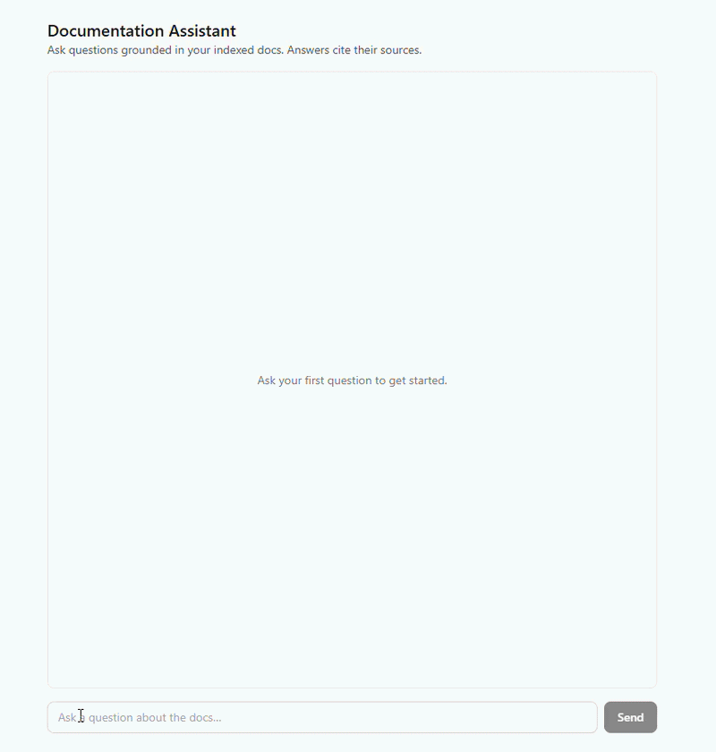

# Simple RAG Chatbot

A minimal, self-hostable RAG chatbot for product documentation. Built with
Next.js (App Router) + TypeScript, LangChain.js, ChromaDB, and OpenRouter.

- **Chat model**: any model on OpenRouter (default `openai/gpt-4o-mini`).
- **Embeddings**: local via `@xenova/transformers` (default `Xenova/all-MiniLM-L6-v2`) — no embedding API key needed.
- **Vector store**: ChromaDB running locally (via Docker).
- **UI**: Tailwind, streaming responses, collapsible source citations.
- **Ingestion**: CLI script or token-protected HTTP endpoint.

The model is instructed to answer **only** from retrieved context and to say
it doesn't know when the answer isn't there. Each answer ships with the chunks
that grounded it.



## Requirements

Software you need installed locally before you start:

| Requirement       | Version       | Notes                                                              |
| ----------------- | ------------- | ------------------------------------------------------------------ |
| Node.js           | 18.18+ or 20+ | Required by Next.js 14. `node --version` to check.                 |
| npm               | 9+            | Ships with Node. Yarn / pnpm work too if you prefer.               |
| Docker            | 20+           | Used to run ChromaDB locally via `docker compose`.                 |
| Docker Compose    | v2 plugin     | Bundled with Docker Desktop; on Linux install `docker-compose-plugin`. |
| Disk space        | ~500 MB free  | Node modules (~250 MB) + embedding model cache (~30 MB) + Chroma data. |
| RAM               | 2 GB free     | Embedding model runs in-process; Chroma container needs ~200 MB.   |

Accounts / keys you need to obtain:

- **OpenRouter API key** — sign up at <https://openrouter.ai/> and create a key
  at <https://openrouter.ai/keys>. Pay-as-you-go; the default model
  `openai/gpt-4o-mini` costs fractions of a cent per question.

Project requirements being satisfied by this codebase (for reference):

- Self-hostable and low-cost (local Chroma + local embeddings; only chat tokens cost money).
- Local ChromaDB for vector storage.
- LangChain.js for ingestion, chunking, retrieval, and chat orchestration.
- OpenRouter for LLM calls via `@langchain/openai`.
- Markdown / text doc support out of the box; PDF is a one-file extension (see [Extending](#extending)).
- Next.js App Router chat UI with streaming responses and source citations.
- CLI ingest script (`npm run ingest`) and optional token-protected HTTP endpoint.
- Strict grounding: model answers only from retrieved context, otherwise says it doesn't know.

## Quick start

### 1. Install dependencies

```bash
npm install
```

First install downloads the embedding model (~30 MB) into the local cache the
first time it's used.

### 2. Configure environment

```bash
cp .env.example .env
```

Edit `.env` and set at least `OPENROUTER_API_KEY`. Defaults are sensible for
local development.

### 3. Start ChromaDB

```bash
npm run chroma          # docker compose up -d chroma
```

Chroma listens on `http://localhost:8000` and persists to `./data/chroma`.

### 4. Add your docs

Drop `.md`, `.markdown`, or `.txt` files into `./data/docs/` (or set
`DOCS_PATH` to another directory).

A sample corpus is already included so you can verify the pipeline before
swapping in your own content:

- [`data/docs/example.md`](data/docs/example.md) — a short placeholder doc.
- [`data/docs/wiki/`](data/docs/wiki/) — a 10-page wiki **about this project
  itself** (overview, requirements, setup, configuration, architecture,
  ingestion/retrieval, API reference, extending, troubleshooting). After
  ingesting it, you can ask the chatbot questions like _"how do I configure
  the chunk size?"_ or _"what are the requirements?"_ as a smoke test.

Delete or replace these files when you're ready to index your own
documentation — the wiki is example content, not part of the runtime.

### 5. Index them

```bash
npm run ingest
# or, index a different folder ad-hoc:
npm run ingest -- ./path/to/other/docs
```

This wipes the collection and re-indexes every file. It's safe to run
repeatedly.

### 6. Run the app

```bash
npm run dev
```

Open <http://localhost:3000> and start asking questions.

## Environment variables

| Variable                  | Required | Default                          | Notes                                              |
| ------------------------- | -------- | -------------------------------- | -------------------------------------------------- |
| `OPENROUTER_API_KEY`      | yes      | —                                | From <https://openrouter.ai/keys>.                 |
| `OPENROUTER_MODEL`        | no       | `openai/gpt-4o-mini`             | Any OpenRouter model slug.                         |
| `OPENROUTER_BASE_URL`     | no       | `https://openrouter.ai/api/v1`   |                                                    |
| `OPENROUTER_SITE_URL`     | no       | `http://localhost:3000`          | Sent as `HTTP-Referer` for OpenRouter attribution. |
| `OPENROUTER_APP_NAME`     | no       | `Simple RAG Chatbot`             | Sent as `X-Title`.                                 |
| `CHROMA_URL`              | no       | `http://localhost:8000`          |                                                    |
| `CHROMA_COLLECTION_NAME`  | no       | `docs`                           |                                                    |
| `EMBEDDING_MODEL`         | no       | `Xenova/all-MiniLM-L6-v2`        | Any `@xenova/transformers` feature-extraction model. |
| `DOCS_PATH`               | no       | `./data/docs`                    |                                                    |
| `RETRIEVAL_K`             | no       | `5`                              | Top-k chunks retrieved.                            |
| `CHUNK_SIZE`              | no       | `1000`                           |                                                    |
| `CHUNK_OVERLAP`           | no       | `150`                            |                                                    |
| `INGEST_TOKEN`            | no       | (empty)                          | If set, `POST /api/ingest` is enabled with this bearer token. |

## HTTP ingest endpoint (optional)

If you set `INGEST_TOKEN`, you can trigger a re-index over HTTP — useful for
deployments where you don't have shell access.

```bash
curl -X POST http://localhost:3000/api/ingest \
  -H "Authorization: Bearer $INGEST_TOKEN"
```

Leave `INGEST_TOKEN` unset to disable the endpoint entirely.

## File structure

```
.
├── app/
│   ├── api/
│   │   ├── chat/route.ts        # NDJSON streaming chat endpoint
│   │   └── ingest/route.ts      # token-protected re-index endpoint
│   ├── globals.css
│   ├── layout.tsx
│   └── page.tsx                 # chat UI (client component)
├── lib/
│   ├── embeddings.ts            # local HF transformer embeddings
│   ├── env.ts                   # env-var parsing
│   ├── ingest.ts                # walk → split → embed → upsert
│   ├── llm.ts                   # ChatOpenAI pointed at OpenRouter
│   ├── rag.ts                   # retrieval + prompt + streaming
│   └── vectorstore.ts           # Chroma helpers
├── scripts/
│   └── ingest.ts                # CLI for npm run ingest
├── data/
│   ├── docs/                    # your markdown / text source files
│   │   ├── example.md           # sample placeholder doc
│   │   └── wiki/                # example: 10-page wiki about this project
│   └── chroma/                  # Chroma persistence (created by docker)
├── docker-compose.yml           # Chroma container
├── .env.example
├── next.config.mjs
├── package.json
├── postcss.config.mjs
├── tailwind.config.ts
└── tsconfig.json
```

## How it works

1. **Ingest** (`lib/ingest.ts`): walks `DOCS_PATH`, reads each `.md`/`.txt`,
   splits with `RecursiveCharacterTextSplitter`, embeds locally, and writes
   to Chroma. The collection is dropped first so re-ingestion is idempotent.
2. **Retrieve** (`lib/rag.ts`): top-k similarity search against Chroma.
3. **Generate** (`lib/rag.ts` + `lib/llm.ts`): the retrieved chunks are
   formatted into a context block with `[n] (source #chunk)` tags and sent
   to OpenRouter with a strict system prompt that forbids using outside
   knowledge.
4. **Stream** (`app/api/chat/route.ts`): tokens stream back as NDJSON; the
   client appends them to the current assistant message and renders sources
   in a collapsible panel.

## Extending

- **PDFs**: add a loader (e.g. `pdf-parse`) and append `.pdf` to
  `SUPPORTED_EXTENSIONS` in `lib/ingest.ts`. Read the file, pass the text
  through the same splitter.
- **Different embeddings**: swap `HuggingFaceTransformersEmbeddings` in
  `lib/embeddings.ts` for `OpenAIEmbeddings`, Voyage, Cohere, etc. Re-ingest
  after changing dimensions.
- **Multiple collections**: parameterize `CHROMA_COLLECTION_NAME` per docset
  and route by namespace.

## Troubleshooting

- **`Missing required environment variable: OPENROUTER_API_KEY`** — copy
  `.env.example` to `.env` and fill in the key.
- **Connection refused on port 8000** — start Chroma (`npm run chroma`) and
  give it a few seconds to come up.
- **First request is slow** — the embedding model is downloaded on first
  use and cached under `node_modules/@xenova/transformers/`.
- **"I don't know" answers on questions you expect to work** — bump
  `RETRIEVAL_K`, raise `CHUNK_SIZE`, or check that `npm run ingest`
  reported the chunks you expected.
